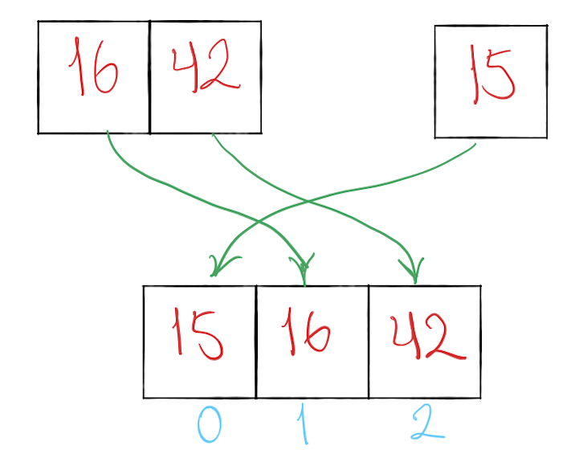

# Merge Sort

### What is Merge Sort?
Merge sort is one of the most popular sorting algorithms today and it uses the concept of divide and conquer to sort a list of elements. Meaning, it will divide the bigger problem into smaller problems and then solve each of the small problems in order to solve the bigger problem that we started out with. 

Source: [Merge Sort Algorithm in JavaScript by Tim Han](https://medium.com/javascript-in-plain-english/javascript-merge-sort-3205891ac060)

Pseudo code:
```
ALGORITHM Mergesort(arr)
    DECLARE n <-- arr.length
           
    if n > 1
      DECLARE mid <-- n/2
      DECLARE left <-- arr[0...mid]
      DECLARE right <-- arr[mid...n]
      // sort the left side
      Mergesort(left)
      // sort the right side
      Mergesort(right)
      // merge the sorted left and right sides together
      Merge(left, right, arr)

ALGORITHM Merge(left, right, arr)
    DECLARE i <-- 0
    DECLARE j <-- 0
    DECLARE k <-- 0

    while i < left.length && j < right.length
        if left[i] <= right[j]
            arr[k] <-- left[i]
            i <-- i + 1
        else
            arr[k] <-- right[j]
            j <-- j + 1
            
        k <-- k + 1

    if i = left.length
       set remaining entries in arr to remaining values in right
    else
       set remaining entries in arr to remaining values in left

```
Let's go step by step:

- First we will start with a unsorted array, we are going t them split the array in half ( or as evenly possible).


----

- Then we are going to split the array in half as evenly as possible.


-----

- Let's keep on moving and look at the next smallest lift down to the left. There ar two elements in this list so we gotta split them up again.


-----
- Now, we have two smallest arrays with a single element in each. When there is a single element left in a list, that means it is ready to be merged.
- Now, we are gonna merged the elements back together in a sorted order. 4 is smaller than 8, so its going to ove to the first position in the array, next 8 can be the second spot.


----
- Now, since 23 is a single element in our list, its ready to merge. 4 is still small than 8, but 8 is smaller than 23, so, 23 we keep 23 at the right side in the last spot of the array.


- We have the left half of the array done.
----
- Now we move on to the right half of the array.
- It looks like the right side of the array can be a single element and can't be split anymore, we move on the left side and again, we split it as evenly as possible.


------

- Once again we have two lists with a single elements. They are ready to merge so let's put them back together in a sorted order. 16 is smaller or less than 42, so it will shift into the first position, and 42 will go next.


- 15 is smaller than 16 so it will move to its rightful spot at the left, 16 is smaller than 42 so it will move to the middle and 42 will go back to the last spot at the right of the array.



-------

- With both halves sorted and ready to merge. We can sort through all the elements and move them form smallest to greatest.


