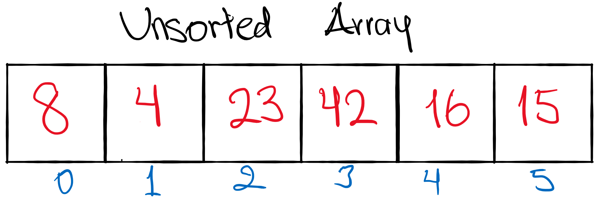
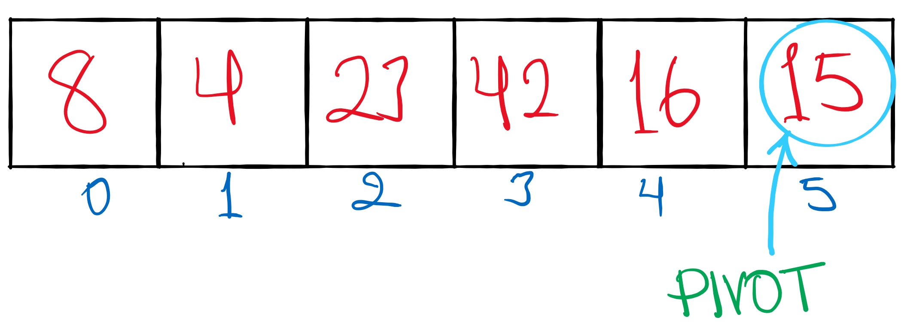
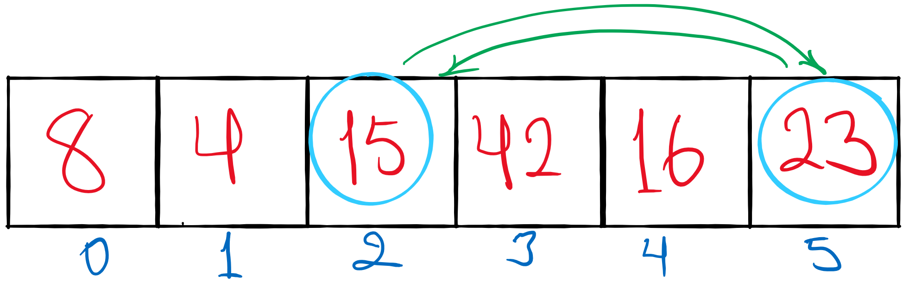
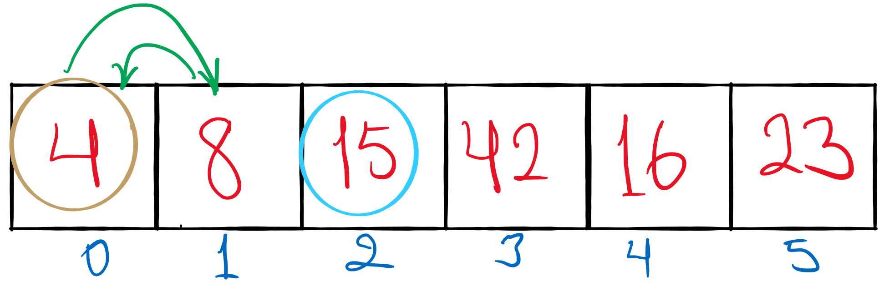
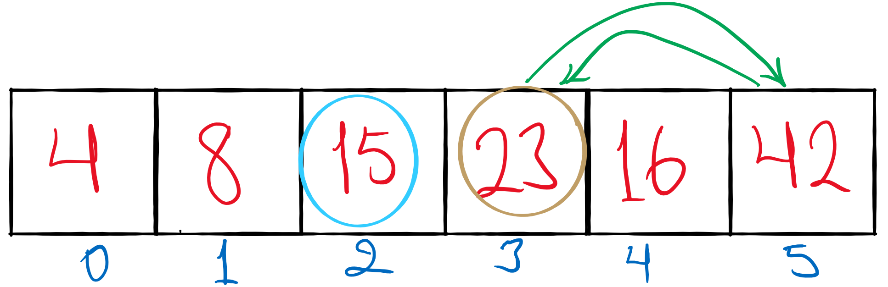
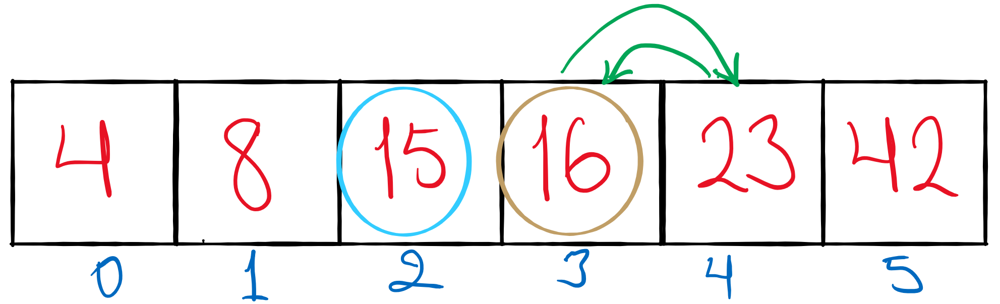
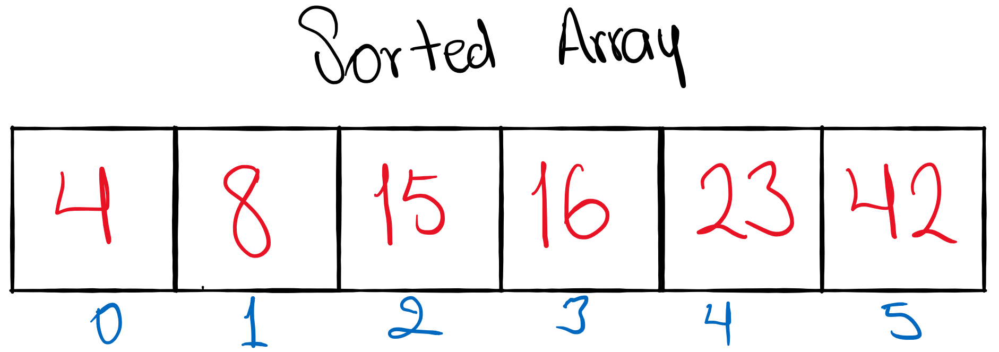

# Quick Sort

This sorting algorithm uses the idea of divide and conquer. It finds an element called the **`pivot`** which divides the array into two halves and sorts each half so the left half is less than the pivot and the elements in the right half are greater than the pivot.

It consists of three steps recursively:
- Find pivot that divides the array into two halves
- Quick sort the left half.
- Quick sort the right half.
### Pseudo Code:
```
ALGORITHM QuickSort(arr, left, right)
    if left < right
        // Partition the array by setting the position of the pivot value 
        DEFINE position <-- Partition(arr, left, right)
        // Sort the left
        QuickSort(arr, left, position - 1)
        // Sort the right
        QuickSort(arr, position + 1, right)

ALGORITHM Partition(arr, left, right)
    // set a pivot value as a point of reference
    DEFINE pivot <-- arr[right]
    // create a variable to track the largest index of numbers lower than the defined pivot
    DEFINE low <-- left - 1
    for i <- left to right do
        if arr[i] <= pivot
            low++
            Swap(arr, i, low)

     // place the value of the pivot location in the middle.
     // all numbers smaller than the pivot are on the left, larger on the right. 
     Swap(arr, right, low + 1)
    // return the pivot index point
     return low + 1

ALGORITHM Swap(arr, i, low)
    DEFINE temp;
    temp <-- arr[i]
    arr[i] <-- arr[low]
    arr[low] <-- temp
```

Let's go step by step:

- First we start with an unsorted array.



---

- Then we are going to pick a pivot. The pivot can be any number at the beginning, end or in the middle. In this example we are going to pick the last element of this array to be our pivot.



----

- Now, we want to compare each single value of the array and put the values greater than 15(pivot) on the right, and smaller values on the left. 



----

- Now, the pivot is now in the middle, we call this partition, so we can keep track of where the center of our array is and how it should be split. 
- Let's sort the left side of the pivot and the right ride of the pivot. Each time we pick a new temporary pivot. 
  - 4 becomes the new pivot of the left side of the array.
  - Compare 4 to 8, 8 is bigger.
  - 4 and 8 swap places.



- Our left sub array is sorted.
----

- Next:
  - 23 becomes the new pivot on the right side of the array.
  - 23 is compare to 16, 16 is smaller, no swap.
  - 23 is compare to 42, 42 is bigger, they swap places.



----

- Last step:
  - 16 becomes new pivot.
  - 16 is compare to 23, 16 is smaller than 23, they swap places.



----

- The result is:



