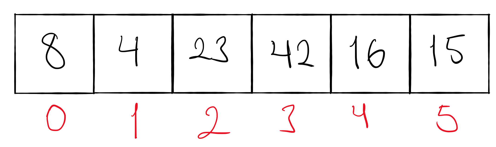
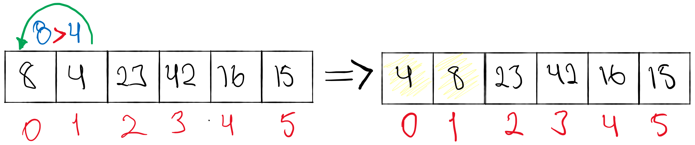
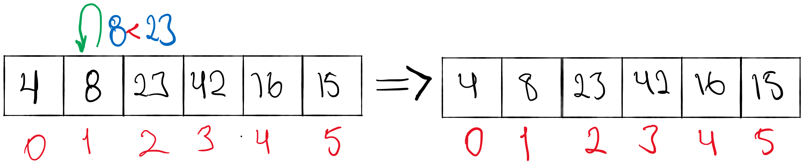
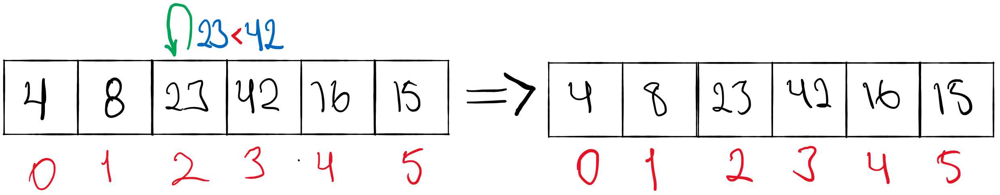
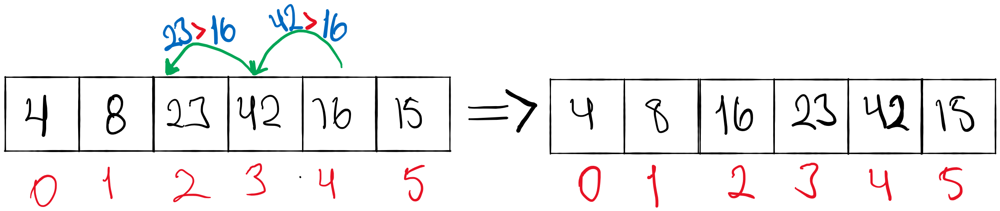
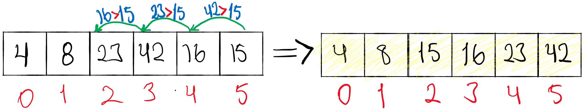

# Insertion Sort

Author: Edgar Romero.

Insertion sort is a simple sorthing algortithm that is split into a sorted and unsorted part. Values in the unsorted part are grabbed and placed into the correct position in the sorted part.

Pseudo code:
```
InsertionSort(int[] arr)
  
    FOR i = 1 to arr.length
    
      int j <-- i - 1
      int temp <-- arr[i]
      
      WHILE j >= 0 AND temp < arr[j]
        arr[j + 1] <-- arr[j]
        j <-- j - 1
        
      arr[j + 1] <-- temp
```

A more understandable visualization can be like the follow:

- For this example we will start with an unsorted array, we began with index 0 being our temp variable which we will compare to the rest of the numbers in the array to see if they are sorted correctly.



--------------

- Next we want to compare the first element against each other.



------------------
- Since 8 is greater than 4 we want to move 4 to its rightful place behind 8 to achieve ascending order.
- Now the tem variable becomes the value of what number is at index 1, which is now 8. We want to compare 8 to the number after it which is 23.



---------------
- 8 is less than 23, so it is sorted correctly and we can move on.
- The temp variable now becomes the value at the index of 2 which is 23.We will once again compare to the next number in the array.



------

- 23 is less than 42, so it is sorted correctly and we can move on.
- The temp variable moves on to the value that is at the index of 3 which is 42. One more time, we compare to the next number in the array.



-----
- 42 is greater than 16, but it doesn't stop there, we need to keep comparing 16 to the numbers down the line to find its rightful spot! 23 is greater than 16 so it needs to keep moving! Finally 8 is less than 16 so it can finally rest happily in its home at index 2... for now!
- We have one last value to compare and it's residing at index 5! 15 is our lucky number!


- 42 is greater than 15 so needs to keep moving. 23 is greater than 15 so on it goes. 16 is also greater than 15 so it marches along and then finally we come to 8, which is less than 15 and our last value can hang out in its new home!

- The result is a sorted list! with ascending values.