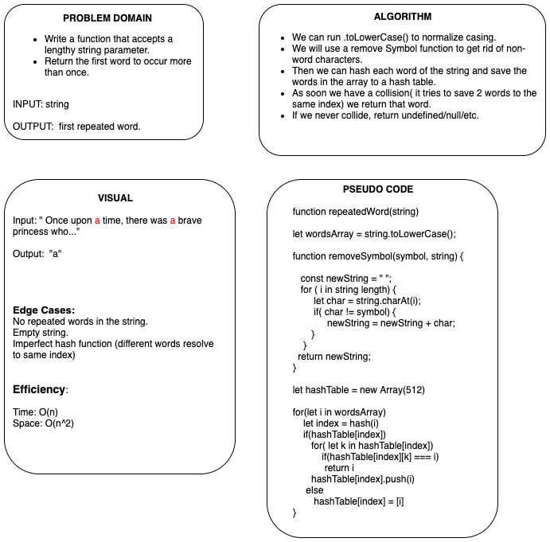

# Repeated Word

# Challenge
- Write a function that accepts a lengthy string parameter.
- Without utilizing any of the built-in library methods available to your language, return the first word to occur more than once in that provided string.

## Approach & Efficiency
<!-- What approach did you take? Why? What is the Big O space/time for this approach? -->
- hash every single word and place it in a hashtable. if there is a collision, check if the two values are the same word.
- if they are the same word, return that repeated word.

## Whiteboard
<!-- Embedded whiteboard image -->

