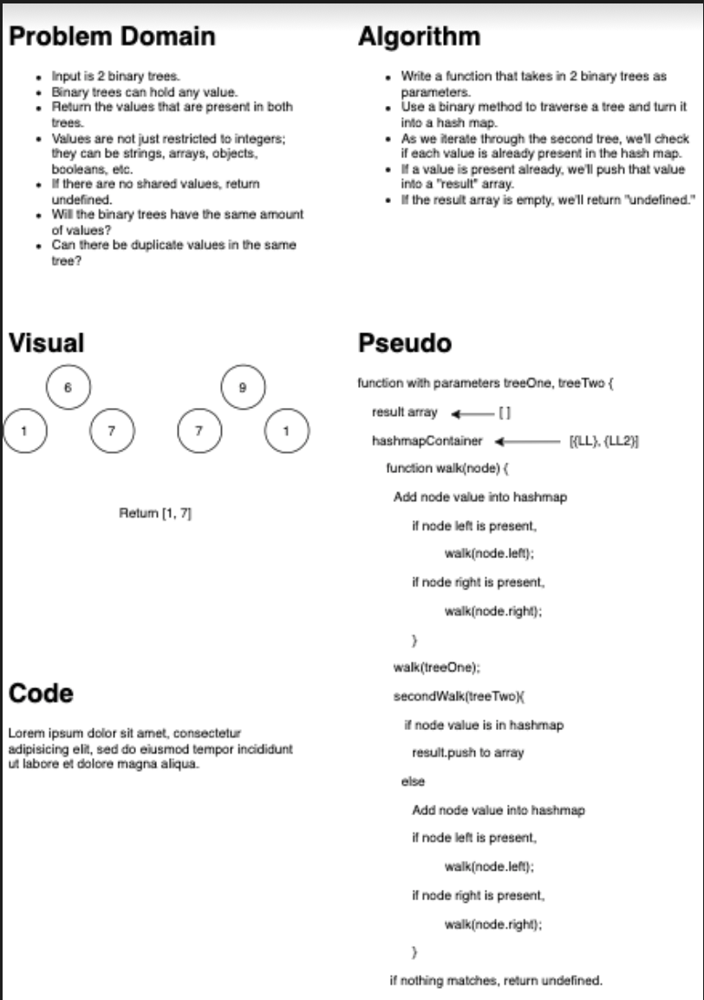

# Tree Intersection
## Challenge Summary
<!-- Short summary or background information -->
- Write a function called tree_intersection that takes two binary tree parameters.
- Without utilizing any of the built-in library methods available to your language, return a set of values found in both trees.

## Challenge Description
<!-- Description of the challenge -->

## Approach & Efficiency
<!-- What approach did you take? Why? What is the Big O space/time for this approach? -->
- use Breadth first to travel through the first tree, put all the values into an array
- use Breath first to travel through the second tree.
- while travelling through the second tree, compare each value to the values from the first tree. If a value is present in both tree push it into a new array
- return the new array that contains all the repeated values.

## Whiteboard

