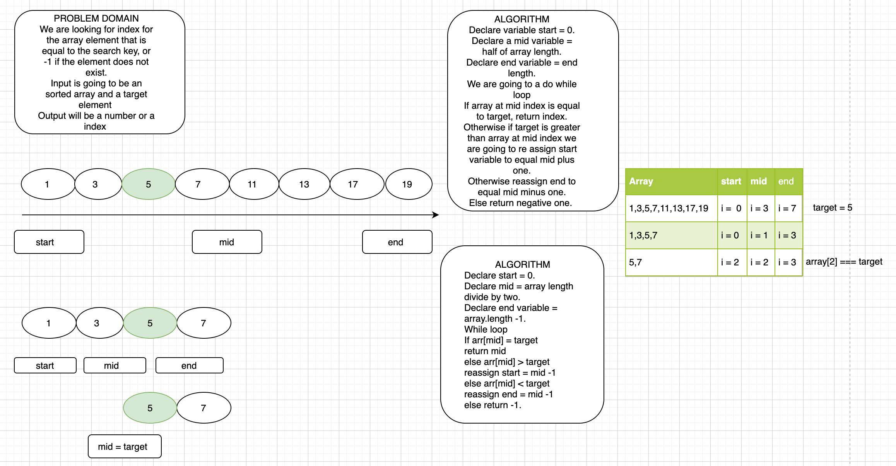

# Challenge Summary
<!-- Short summary or background information -->
Use a binary search to find the index of a target.

## Challenge Description
<!-- Description of the challenge -->
Given an array and a target, find the index of a target.

## Approach & Efficiency
<!-- What approach did you take? Why? What is the Big O space/time for this approach? -->
We declared 3 variables, a start, mid and end, We looked at the entire array. We compared the target to the middle of the array. If target was greater than the mid, we only looked at the greater half of the array on the next iteration. And vice versa. Every iteration we halfed the array we looked at.

## Solution
<!-- Embedded whiteboard image -->

