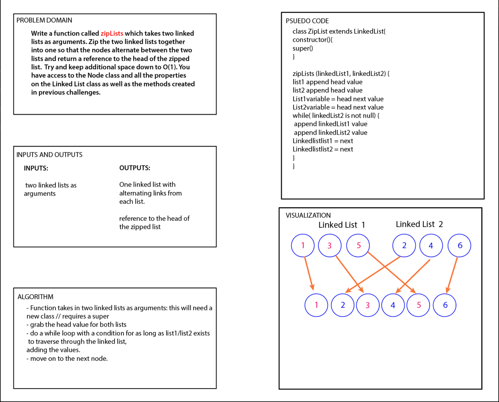

# Challenge Summary
<!-- Short summary or background information -->

## Challenge Description
<!-- Description of the challenge -->
- Create a Node class that has properties for the value stored in the Node, and a pointer to the next Node.
- Within your linked list class, include a head property. Upon instantiation, an empty linked list should be created.
- Add append() method, that allows user to add a given value to the end of a list. 
- Add insertBefore() method, allows a user to add a new value before pre-existing value.
- Add insertAfter that adds a new node value after a node value.
- Add zip() method that combines two linked list into one alternating list.

## Approach & Efficiency
<!-- What approach did you take? Why? What is the Big O space/time for this approach? -->

## Solution
<!-- Embedded whiteboard image -->

